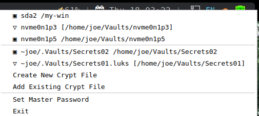

> **THIS IS A WORK IN PROGRESS.  BE PATIENT.**

# LUKS Tray

A system tray applet for Linux to ease mounting and unmounting ad hoc LUKS-encrypted containers (partitions and files).

> *This tool does not not full disk encryption management.*

## Features

- **System tray integration** - Simple click-to-mount/unmount interface
- **Visual status indicators** - Clear icons showing mounted (✅), unmounted (🔳), and open-but-unmounted (‼️) states
- **Password management** - Optional master password to encrypt stored credentials
- **Auto-unmount** - Configurable automatic unmounting
- **File container support** - Mount encrypted files as loop devices
- **Mount point history** - Remembers previous mount locations for convenience
- **Background monitoring** - Automatically detects newly inserted devices with LUKS containers

## Quick Start

1. Install and run `luks-tray`
2. Click the tray icon to see available containers. You may:
    - Insert a disk with LUKS devices to detect them automatically.
    - Add an existing or create a new encrypted file to manage it.
4. Click a container to mount (🔳) or unmount (✅ or ‼️)
5. When mounting a container, enter its password and choose mount point in the dialog
    - if the mount point is empty, then the mount point is automatically chosen.

## Visual Interface

The tray icon shaped like a shield changes based on container states:
-  - All containers are locked and unmounted (i.e., all data is secure).
-  - Some containers are unlocked but unmounted (i.e., one or more anomalies).
-  - Some containers are mounted w/o any anomalies (i.e., some of the encrypted data is available)

Here is an sample menu:

Notes:
- the first section shows LUKS devices, and the second shows LUKS files.
- click a ✅ entry to dismount and lock a mounted,
-  unlocked LUKS container
- click a 🔳 entry to mount a locked LUKS container
- click a ‼️ entry to lock an unmounted, unlocked container (considered an anomaly)
- or click of the action lines to perform the described action
- LUKS files are only automatically detected in its history; when you add or create new LUKS files, they are added to the history.
- LUKS devices must be created with other tools such as Gnome Disks.

## Configuration

Settings are stored in `~/.config/luks-tray/`:
- **History file** - Encrypted storage of passwords and mount preferences (when master password enabled)
- **Configuration file** - allows configuration of:

    - whether passwords are shown by default.
    - whether ‼️ entries (i.e., anomalies) cause the tray icon to change to the alert shield.

## Security Notes

- Passwords are only stored when master password feature is enabled
- History file is encrypted using the master password
- System mount points are excluded by default to prevent interference with disk encryption

## Requirements

- Linux with LUKS/cryptsetup support
- PyQt6
- Standard utilities: `lsblk`, `cryptsetup`, `mount`, `umount`

## Limitations

- **Not for whole disk encryption** - Excludes system mount points like `/`, `/home`, `/var` to avoid interfering with boot-time encrypted volumes
- **No udisks2 integration** - May not always play nicely with desktop auto-mounting tools; so mount and unmount containers with the same tool for the best results.
- **Loop device requirement** - File containers require `lsblk` to show them as loop devices (standard on most distros)
- **Single filesystem focus** - Containers with multiple filesystems are out of scope of this tool and get very limited support (i.e., mostly handling only the first filesystem).

---

Test Notes:
  - for no filesystems:
    - sudo dd if=/dev/zero of=/tmp/test_luks_container bs=1M count=100
    - sudo cryptsetup luksFormat /tmp/test_luks_container
    - sudo cryptsetup open /tmp/test_luks_container test_luks
  - for two file systems:
    - sudo pvcreate /dev/mapper/test_luks
    - sudo vgcreate test_vg /dev/mapper/test_luks
    - sudo lvcreate -L 20M -n lv1 test_vg
    - sudo lvcreate -L 20M -n lv2 test_vg
    - sudo mkfs.ext4 /dev/test_vg/lv1
    - sudo mkfs.ext4 /dev/test_vg/lv2